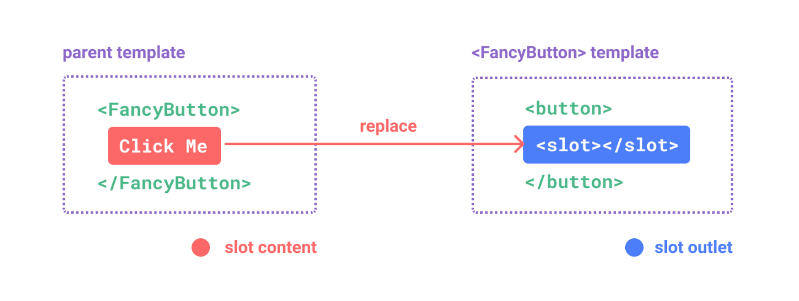
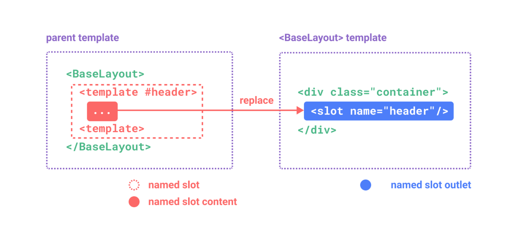
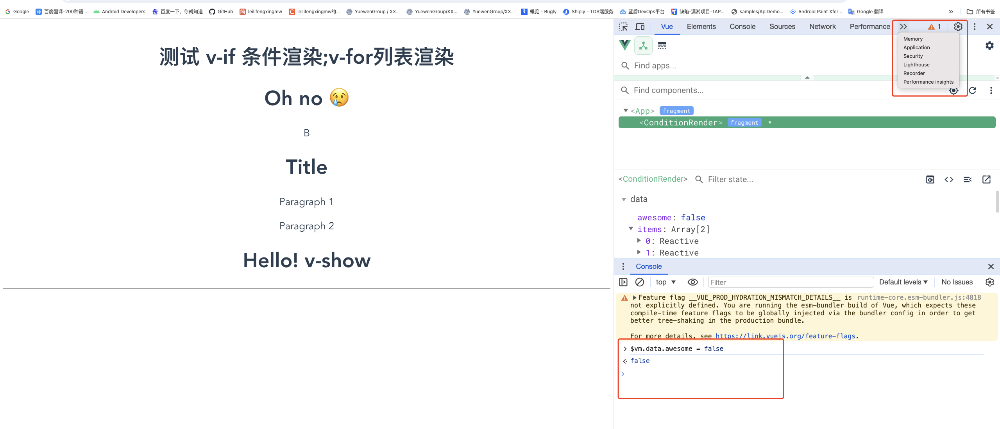

# vue-hello-world

使用的vue版本 3x
使用的node版本 20.10.0


### Props & Attributes 

在 Vue 中，props 和 attributes 是两种不同的概念，它们都用于父组件向子组件传递数据，但是使用方式和场景有所不同。

Props 是父组件向子组件传递数据的一种方式。子组件需要显式地在 props 选项中声明它期望接收的 props。props 是单向数据流，也就是说，子组件不能修改从父组件接收的 props，任何尝试修改 props 的操作都会在控制台中产生警告。

Attributes 是 HTML 元素的标准特性，例如 id、class、style 等。在 Vue 中，如果你在一个组件上使用了非 prop 特性（即没有在子组件的 props 选项中定义的特性），它们会被添加到组件的根元素上。


### 插槽





[Vue3 深入组件插槽](https://cn.vuejs.org/guide/components/slots.html)

组件能够接收任意类型的 JavaScript 值作为 props，但组件要如何接收模板内容呢？在某些场景中，我们可能想要为子组件传递一些模板片段，让子组件在它们的组件中渲染这些片段。
`<slot>` 元素是一个插槽出口 `(slot outlet)`，标示了父元素提供的插槽内容 `(slot content)` 将在哪里被渲染。


* 作用域插槽

插槽的内容无法访问到子组件的状态。然而在某些场景下插槽的内容可能想要同时使用父组件域内和子组件域内的数据。要做到这一点，我们需要一种方法来让子组件在渲染时将一部分数据提供给插槽。


### 依赖注入

解决 `prop逐级传递` 的问题.
provide 和 inject 可以帮助我们解决这一问题。 一个父组件相对于其所有的后代组件，会作为依赖提供者。任何后代的组件树，无论层级有多深，都可以注入由父组件提供给整条链路的依赖。

* 要为组件后代提供数据，需要使用到 provide 选项


### 状态管理

### 略过 服务端渲染(SSR)


### 使用 Vuejs/devtools

版本 6.6.1 版本
[Vue.js devtools](https://chrome.google.com/webstore/detail/vuejs-devtools/nhdogjmejiglipccpnnnanhbledajbpd)

开始在浏览器里找不到，是因为右边太窄了，vue选项在下拉菜单里。点击vue选项，vue选项就会排到第一个。点击元素，就可以在console里看到vue的数据了。

$vm.data 就是vue的数据了。


    

## Project setup
```
npm install
```

### Compiles and hot-reloads for development
```
npm run serve
```

### Compiles and minifies for production
```
npm run build
```

### Lints and fixes files
```
npm run lint
```

### Customize configuration
See [Configuration Reference](https://cli.vuejs.org/config/).
